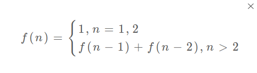
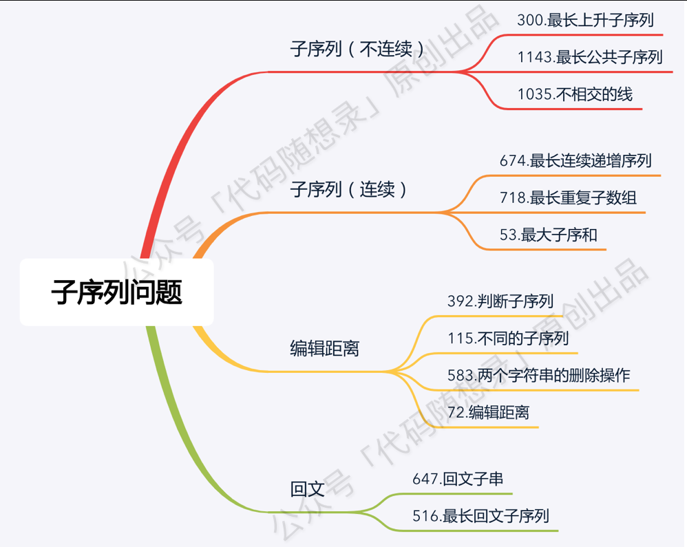

# 																																				动态规划算法

## 动态规划问题的性质

1. 重叠子问题 => 备忘录

2. 最优子结构

   > **要符合「最优子结构」，子问题间必须互相独立**

## 基本概念

- 带备忘录的递归解法的效率已经和迭代的动态规划解法一样了。实际上，这种解法和迭代的动态规划已经差不多了，只不过这种方法叫做「自顶向下」，动态规划叫做「自底向上」。

- 啥叫「自顶向下」？注意我们刚才画的递归树（或者说图），是从上向下延伸，都是从一个规模较大的原问题比如说 $f(20)$，向下逐渐分解规模，直到 $f(1)$ 和 $f(2)$ 这两个 base case，然后逐层返回答案，这就叫「自顶向下」。

- 啥叫「自底向上」？反过来，我们直接从最底下，最简单，问题规模最小的 $f(1)$ 和$f(2)$开始往上推，直到推到我们想要的答案 $f(20)$​，这就是动态规划的思路，这也是为什么动态规划一般都脱离了递归，而是由循环迭代完成计算。

  > **动态规划的基础是递归**

## 术语

`状态转移方程` 你把 $f(n)$​ 想做一个状态 $n$​ ，这个状态 $n$​ 是由状态 $n - 1$​ 和状态 $n - 2$​​ 相加转移而来，这就叫状态转移，例如



> **状态转移方程直接代表着暴力解法**：**动态规划问题最困难的就是写出这个暴力解，即状态转移方程**。只要写出暴力解，优化方法无非是用备忘录或者 DP table，再无奥妙可言。

`状态压缩` 如果我们发现每次状态转移只需要 DP table 中的一部分，那么可以尝试用状态压缩来缩小 DP table 的大小，只记录必要的数据

`子序列` 子序列不一定是连续的

`字串` 子串一定是连续的

`最长递增子序列(LIS)` Longest Increasing Subsequence

`最长连续序列(LCS)` Longest Consecutive Sequence

`最长连续递增序列(LCIS)` Longest Continuous Increasing Subsequence

`最长公共子序列(LCS)` Longest Common Subsequence

## 涉及题目的类型

- 子序列问题

  > **可以说只要涉及子序列问题，十有八九都需要动态规划来解决**

- 字串问题

## 相关题目

### 一维dp

#### [322. 零钱兑换](https://leetcode-cn.com/problems/coin-change/)

一句话题目描述：返回可以凑成总金额所需的 **最少的硬币个数**


`注` 

1. 要注意第11行的判断，若减去当前硬币后值<0，则说明不可以减去

2. 本题的`状态转移方程`为

   

#### [518. 零钱兑换 II](https://leetcode-cn.com/problems/coin-change-2/)

见“二维dp（完全背包问题）”

#### [300. 最长递增子序列](https://leetcode-cn.com/problems/longest-increasing-subsequence/) ★

题目描述：给你一个整数数组 nums ，找到其中最长`严格递增` `子序列`的长度。

```C++
class Solution {
public:
    int lengthOfLIS(vector<int>& nums) {
        vector<int> dp(nums.size(), 1); //将dp[i]都初始化为1，因为子序列的长度至少为1，包含其自身

        for(int i = 0; i < nums.size(); i++){
            for(int j = 0; j < i; j++){
                if(nums[i] > nums[j]){
                    dp[i] = max(dp[i], dp[j] + 1);
                }
            }
        }

        int maxL = dp[0];
        for(int i = 0; i < nums.size(); i++){
            maxL = max(maxL, dp[i]);
        }

        return maxL;
    }
};
```

`注`

1. 十分重要的是，本题中 $dp[i]$ 的定义为以 <u>数组中索引为 $i$ 的元素为结尾的最大子序列的长度</u>，所以要计算 $dp[i]$ 时，只需要在 $dp[j], j < i$ 的基础上 +1即可，当然需要满足，$nums[i] > nums[j]$​​，才能串起来成严格递增，所以本题的`状态转移方程`为


2. 本题的拓展请看下一标题，[354. 俄罗斯套娃信封问题](https://leetcode-cn.com/problems/russian-doll-envelopes/)

#### [354. 俄罗斯套娃信封问题](https://leetcode-cn.com/problems/russian-doll-envelopes/)

一句话题目描述：给你一个二维整数数组 envelopes ，其中 envelopes[i] = [wi, hi] ，表示第 i 个信封的宽度和高度。

​	当另一个信封的宽度和高度都比这个信封大的时候，这个信封就可以放进另一个信封里，如同俄罗斯套娃一样。

​	请计算 最多能有多少个 信封能组成一组“俄罗斯套娃”信封（即可以把一个信封放到另一个信封里面），例如：


```C++
class Solution {
public:
    int maxEnvelopes(vector<vector<int>>& envelopes) {
        /* 1. 最重要的一步：按照宽度升序排列，宽度相等的时候按照高度降序排列 */
        struct cmp{
            bool operator()(vector<int> envelope1, vector<int> envelope2){
                if(envelope1[0] == envelope2[0]) return envelope1[1] > envelope2[1];
                return envelope1[0] < envelope2[0];
            }
        };
        sort(envelopes.begin(), envelopes.end(), cmp());

        /* 2. 然后就只需要对高度序列做“最大递增子序列”算法即可 */
        vector<int> dp(envelopes.size(), 1); // 将dp[i]都初始化为1，因为子序列的长度至少为1，包含其自身

        for(int i = 0; i < envelopes.size(); i++){
            for(int j = 0; j < i; j++){
                if(envelopes[j][1] < envelopes[i][1]) dp[i] = max(dp[i], dp[j] + 1);
            }
        }

        int maxL = dp[0];
        for(int i = 0; i < envelopes.size(); i++){
            maxL = max(maxL, dp[i]);
        }

        return maxL;
    }
};
```

`注`

1. 本题中最关键的一条思路是要对二维数组进行排序，先对宽度进行升序排列（`为了确保之后的高度递增情况下，宽度一定满足`），宽度相同的情况下，对高度进行降序排列，如下图所示：

   

   其中，之所以要对高度降序排列，是因为：

   > 假如我们仍像方法一一样，仅针对宽度排序。那么对于形如 [4, 4] 和 [4, 5]的两项，由于 [4, 4] 排序在 [4, 5]之前，这就导致仅考虑h时，我们认为 [4, 4]和 [4, 5]可以构成一组“套娃”。但是按照“二维严格升序”的定义，两个矩形的宽相等，不属于严格升序。
   >
   > 为了规避上述的问题，我们对宽度相等的两个矩形，使用高度降序排序，这样一来，上述问题的排列将变成： [4, 5], [4, 4]。在我们计算最长上升子序列时，由于 5>4，也就不会出现“错误套娃”。
   >
   
   然后就需要对高度进行最大递增子序列算法即可。

#### [53. 最大子序和](https://leetcode-cn.com/problems/maximum-subarray/)

题目描述：给定一个整数数组 $nums$ ，找到一个具有最大和的连续子数组（子数组最少包含一个元素），返回其最大和

```C++
class Solution {
public:
    int maxSubArray(vector<int>& nums) {
        vector<int> dp(nums);

        for(int i = 1; i < nums.size(); i++){
            dp[i] = max(dp[i], dp[i - 1] + nums[i]);
        }

        int maxS = INT_MIN;
        for(int i = 0; i < nums.size(); i++){
            maxS = max(maxS, dp[i]);
        }

        return maxS;
    }
};
```

`注`

1. $dp$用$nums$数组来初始化，因为这里$dp[i]$ <u>数组中索引为 $i$​​ 的元素为结尾的最大连续子数组和</u>，所以$dp[i]$​最小也应该为包含自己本身

### 二维dp（涉及两个字符串）

#### [1143. 最长公共子序列](https://leetcode-cn.com/problems/longest-common-subsequence/) ★

题目描述：给定两个字符串 $text1$​ 和 $text2$​，返回这两个字符串的最长 **公共子序列** 的长度。如果不存在 **公共子序列** ，返回 0

```C++
class Solution {
public:
    int longestCommonSubsequence(string text1, string text2) {
        vector<vector<int>> dp(text1.size() + 1, vector<int>(text2.size() + 1, 0));

        for(int i = 1; i <= text1.size(); i++){
            for(int j = 1; j <= text2.size(); j++){
                if(text1[i - 1] == text2[j - 1]) dp[i][j] = dp[i - 1][j - 1] + 1; // dp[i][j]的含义是text1[0..i-1], text2[0..j-1]的最大公共子序列，对应好的
                else dp[i][j] = max(dp[i - 1][j], dp[i][j - 1]);
            }
        }

        return dp.back().back();
    }
};
```

`注`

1. 本题是字符串动态规划的经典题目，也是使用二维dp的经典题目

2. 同理为了匹配空字符串，同样dp数组有偏移，即$dp[i][j]$​​​的含义是text1[0..i-1], text2[0..j-1]的最大公共子序列，要注意，这个偏移影响的地方有`2`：

   - 比较明显的地方是：dp数组需要扩大+1

   - 需要特别注意的是：

     ```C++
     if(text1[i - 1] == text2[j - 1]) dp[i][j] = dp[i - 1][j - 1] + 1;
     ```

     不能写成：

     ```C++
     if(text1[i] == text2[j]) dp[i][j] = dp[i - 1][j - 1] + 1;
     ```

     因为在$text1[i - 1] == text2[j - 1]$​ 条件下研究的是$dp[i][j]$​ ​

3. 最后，本题的状态转移方程为

   

   > 知道状态定义之后，我们开始写状态转移方程

   > 当 $text1[i - 1] == text2[j - 1]$ 时，说明两个子字符串的最后一位相等，所以最长公共子序列又增加了 1，所以 $dp[i][j] = dp[i - 1][j - 1] + 1$；举个例子，比如对于 ac 和 bc 而言，他们的最长公共子序列的长度等于 a 和 b 的最长公共子序列长度 0 + 1 = 1。
   > 当 $text1[i - 1] != text2[j - 1]$ 时，说明两个子字符串的最后一位不相等，那么此时的状态 $dp[i][j]$ 应该是 $dp[i - 1][j] 和 dp[i][j - 1]$ 的最大值。举个例子，比如对于 ace 和 bc 而言，他们的最长公共子序列的长度等于 ① ace 和 b 的最长公共子序列长度0 与 ② ac 和 bc 的最长公共子序列长度1 的最大值，即 1。
   > 综上状态转移方程为：

   > $dp[i][j] = dp[i - 1][j - 1] + 1   			text1[i−1]==text2[j−1]$​;
   > $dp[i][j] = max(dp[i - 1][j], dp[i][j - 1]) 	text1[i−1]!=text2[j−1]$​
   
4. 本题的拓展为[72. 编辑距离](https://leetcode-cn.com/problems/edit-distance/) 


#### [72. 编辑距离](https://leetcode-cn.com/problems/edit-distance/) ★

题目描述：给你两个单词 $word1$​ 和 $word2$​，请你计算出将 $word1$​ 转换成 $word2$​ 所使用的最少操作数 。

```C++
class Solution {
public:
    int minDistance(string word1, string word2) {
        // 由于要考虑空的字符串，所以dp初始化为字符串的长度+1，通常字符串的动态规划都这样初始化
        vector<vector<int>> dp(word1.size() + 1, vector<int>(word2.size() + 1, 0));
        // 第0列初始化，由s1转化成s2，随着s1的字符串长度每+1，删除操作+1
        for(int i = 0; i <= word1.size(); i++){
            dp[i][0] = i;
        }
        // 第0行初始化，由s1转化成s2，随着s2的字符串长度每+1，插入操作+1
        for(int j = 0; j <= word2.size(); j++){
            dp[0][j] = j;
        }

        for(int i = 1; i <= word1.size(); i++){
            for(int j = 1; j <= word2.size(); j++){
                if(word1[i -1] == word2[j - 1]) dp[i][j] = dp[i - 1][j -1];
                else{
                    dp[i][j] = min(min(dp[i - 1][j -1] + 1, dp[i][j -1] + 1), dp[i - 1][j] + 1); //min函数只能比较两者大小
                }
            }
        }

        return dp.back().back();
    }
};
```

`注`

1. 本题是字符串动态规划的经典题目，也是使用二维dp的经典题目

2. 第一个要思考清楚的问题是，dp数组的含义和大小，以及下标的对应关系

   - 首先，对于dp数组的大小，需要在 $s1.size()$ 和 $s2.size()$ 的基础上均+1，这是为了存储`空字符串`，如下图<u>粉红色的行和列</u>所示：

     

   - 其次，对于$dp[i][j]$​​​​​​​而言,表示存储 $s1[0..i - 1]$​ 和 $s2[0..j - 1] $​($i>0, j>0$​) 的最小编辑距离

     所以，两重for循环都要$<=$

     ```C++
         for(int i = 1; i <= word1.size(); i++){
             for(int j = 1; j <= word2.size(); j++){
     ```

   > 比如对于本题而言，可以定义 $dp[i][j]$​​ 表示 $text1[0:i-1]$ 和$ text2[0:j-1]$ 的最长公共子序列。 （注：$text1[0:i-1]$ 表示的是 $text1$ 的 第 0 个元素到第 $i - 1$ 个元素，两端都包含）
   > 之所以 $dp[i][j]$ 的定义不是 $text1[0:i]$ 和 $text2[0:j]$ ，是为了方便当 $i = 0$ 或者 $j = 0$ 的时候，$dp[i][j]$ 表示的为空字符串和另外一个字符串的匹配，这样 $dp[i][j]$​ 可以初始化为 0.
   
3. 本题的核心思路是，

   - if ($word1[i - 1] == word2[j - 1]$)

     不操作

   - if ($word1[i - 1] != word2[j - 1]$)

     增 $dp(i, j - 1) + 1$,    **# 插入** **# 解释：** **# 我直接在 s1[i] 插入一个和 s2[j] 一样的字符** **# 那么 s2[j] 就被匹配了，前移 j，继续跟 i 对比** **# 别忘了操作数加一**

     删 $dp(i - 1, j) + 1$,    **# 删除** **# 解释：** **# 我直接把 s[i] 这个字符删掉** **# 前移 i，继续跟 j 对比** **# 操作数加一**

     换 $dp(i - 1, j - 1) + 1$ **# 替换** **# 解释：** **# 我直接把 s1[i] 替换成 s2[j]，这样它俩就匹配了** **# 同时前移 i，j 继续对比** **# 操作数加一**

   取步数最少的那一种+1步，即得$dp[i][j]$​

#### [10. 正则表达式匹配](https://leetcode-cn.com/problems/regular-expression-matching/) ★

题目描述：给你一个字符串 $s$​ 和一个字符规律 $p$​，请你来实现一个支持 $'.'$​ 和 $'*'$​ 的正则表达式匹配。

```C++
class Solution {
public:
    bool isMatch(string s, string p) {
        int m = s.size();
        int n = p.size();
        vector<vector<bool>> dp(m + 1, vector<bool>(n + 1, false));
        dp[0][0] = true;
        for(int j = 1; j <= n; j++){
            if(p[j - 1] == '*' && dp[0][j - 2] == true){
                dp[0][j] = true;
            }
        }

        for(int i = 1; i <= m; i++){
            for(int j = 1; j <= n; j++){
                if(s[i - 1] == p[j - 1] || p[j - 1] == '.') dp[i][j] = dp[i - 1][j - 1];
                else if (p[j - 1] == '*'){
                    // 碰到*，模式串应该往前找一位，然后和字符串的当前位对比
                    if(p[j - 2] != s[i - 1] && p[j - 2] != '.'){
                        dp[i][j] = dp[i][j - 2];
                    }
                    else{
                        // 真的去动手填表，就会立马理解
                        // 建议采用的例子 s = "aab"; p = "c*a*b"
                        // 匹配 0个 / 1位 / 多个
                        dp[i][j] = dp[i][j - 2] || dp[i][j - 1] || dp[i - 1][j];
                    }
                }
                // 都是正常字符且不匹配
                else{
                    dp[i][j] = false;
                }
            }
        }
		// dp表输出对比
        // for(int i = 0; i <= m; i++){
        //     for(int j = 0; j <= n; j++){
        //         cout << dp[i][j] << ", ";
        //     }
        //     cout << endl;
        // }

        return dp[m][n];
    }
};
```

`注`

1. 初始化

   ```C++
       dp[0][0] = true;
       for(int j = 1; j <= n; j++){
           if(p[j - 1] == '*' && dp[0][j - 2] == true){
               dp[0][j] = true;
           }
       }
   ```

   需要特别注意这里的初始化，从下面的dp表中也可以看出，类似于$c*a*$的模式串是可以成功匹配空字符串的

2. 状态转移方程

   这道题最麻烦的就是状态转移，首先确定dp数组的含义：$dp[i][j]$表示字符串的前$i - 1$位与模式串的前$j - 1$位能否成功匹配

   然后状态转移分为一下几种情况：

   - $p[j -1] == s[i - 1]$ 或者 $p[j - 1] == '.'$    说明当前考虑位可以匹配，则，$dp[i][j]$由前面的子问题$dp[i - 1][j - 1]$​决定 
   - $p[j -1] != s[i - 1]$​​​ 
     - 如果$p[j -1] == '*' $ ，则需要考虑模式串的前一位是否与字符串匹配（这是因为*是对前一位的拷贝）
       - 如果前一位不匹配，则拷贝0次，$dp[i][j] = dp[i][j - 2]$​
       
       - 如果是匹配的，则尝试拷贝0次/1次/2次
       
        > 这里拷贝0次和和上一条的区别在于：
         > 例子：$s:aab$，$p:aabb*$,虽然$j-2$和$i-1$相等，但是$dp[i][j-2]$已经匹配了，直接删去$j-1$和$j-2$​​即可（你来之前我们就已经是总冠军了）
         >
         > $dp[i][j] = dp[i][j-2] $(取0个字符)
         >

3. dp表

4. 真的去动手填表，就会立马理解，例如下表和状态转移之间的对应关系，特别关注蓝色圈的那个点


### 二维dp（涉及一个字符串）

#### [516. 最长回文子序列](https://leetcode-cn.com/problems/longest-palindromic-subsequence/)

题目描述：给你一个字符串 $s$​ ，找出其中最长的回文子序列，并返回该序列的长度。

```C++
class Solution {
public:
    int longestPalindromeSubseq(string s) {
        int sz = s.size();
        vector<vector<int>> dp(sz, vector<int>(sz, 0));

        // base case 
        for(int i = 0; i < sz; i++){
            dp[i][i] = 1; // 重要，将对角线元素初始化为1
        }

        /* 为了确保计算当前dp[i][j]时，其左边，做下，下边的单元都已经先计算完毕，因此采用倒序遍历的方式 */
        for(int i = sz - 1; i >= 0; i--){
            for(int j = i + 1; j < sz; j++){
                if(s[i] == s[j]) dp[i][j] = dp[i + 1][j - 1] + 2;
                else{
                    dp[i][j] = max(dp[i + 1][j], dp[i][j - 1]);
                }
            }
        }

        return dp[0][sz - 1];
    }
};
```

`注`

1. 此处dp数组的定义就很直接，没有偏移，因为不涉及两个字符串，直接定义为：**在子串`s[i..j]`中，最长回文子序列的长度为`dp[i][j]`**

2. 本题的状态转移方程为

   ```C++
   if (s[i] == s[j])
       // 它俩一定在最长回文子序列中
       dp[i][j] = dp[i + 1][j - 1] + 2;
   else
       // s[i+1..j] 和 s[i..j-1] 谁的回文子序列更长？
       dp[i][j] = max(dp[i + 1][j], dp[i][j - 1]);
   ```

3. 本题中最关键的是遍历的顺序，如下图dp数组的图所示

   

   **为了保证每次计算`dp[i][j]`，左、下、左下三个方向的位置已经被计算出来，只能`斜着遍历`或者`反着遍历`**

#### [887. 鸡蛋掉落](https://leetcode-cn.com/problems/super-egg-drop/)「困难」

题目描述：k个鸡蛋，n层楼，计算最少需要多少次可以确定鸡蛋从哪一楼掉下会破碎的最小值。

> 参考1：[liweiwei的题解](https://leetcode-cn.com/problems/super-egg-drop/solution/dong-tai-gui-hua-zhi-jie-shi-guan-fang-ti-jie-fang/)

##### 解法1「部分case超时」

```C++
class Solution {
public:
    int superEggDrop(int k, int n) {
        vector<vector<int>> dp(n + 1, vector<int>(k + 1, 1001));

        // 楼层为0，无法测量
        for(int j = 0; j <= k; j++){
            dp[0][j] = 0;
        }
        // 楼层为1，只要1个鸡蛋
        dp[1][0] = 0;
        for(int j = 0; j <= k; j++){
            dp[1][j] = 1;
        }
        // 鸡蛋为0，无法测量; 鸡蛋为1，测量数=楼层数
        for(int i = 0; i <= n; i++){
            dp[i][0] = 0;
            dp[i][1] = i;
        }

        for(int i = 2; i <= n; i++){
            for(int j = 2; j <= k; j++){
                for(int k = 1; k <= i; k++){
                    dp[i][j] = min(dp[i][j], max(dp[k - 1][j - 1], dp[i - k][j]) + 1);
                }
            }
        }

        return dp[n][k];
    }
};
```

`注`

1. 本题中dp数组的含义为：$dp[i][j]$​：一共有 i 层楼梯`（注意：这里 i 不表示高度）`的情况下，使用 j 个鸡蛋的最少实验的次数

   说明：

   - i 表示的是楼层的大小，不是高度（第几层）的意思，例如楼层区间 [8, 9, 10] 的大小为 33
   - j 表示可以使用的鸡蛋的个数，它是约束条件「习惯于将限制条件写在第二维的位置」

   依次可以画出dp数组的表格如下图所示：

   

2. 推导状态转移方程「可以参考https://www.bilibili.com/video/BV1KE41137PK?from=search&seid=17973611971894816621」李永乐老师的理论分析视频

   即对于$dp[i][j]$​而言，

   

   前一项表示任从第k层扔下，鸡蛋碎了，因此楼层选择从[1, k-1] 共k-1层，鸡蛋剩余j- 1个；后一项表示第k层扔下，鸡蛋没碎，因此楼层选择从[k+1， i] ,共i-k层，鸡蛋数量不变；由于考虑最坏情况，所以在这两者之中选最大值；最后由于k任取，所以遍历k，取得最优的方案需要的最多的次数。

3. 但是由于k的线性寻找，时间复杂度，$O(N^2K)$​​，会有部分case超时；因此将k的寻找用二分搜索代替

##### 解法2

```C++
class Solution {
public:
    int superEggDrop(int k, int n) {
        vector<vector<int>> dp(n + 1, vector<int>(k + 1, 10001));

        // 楼层为0，无法测量
        for(int j = 0; j <= k; j++){
            dp[0][j] = 0;
        }
        // 楼层为1，只要1个鸡蛋
        dp[1][0] = 0;
        for(int j = 0; j <= k; j++){
            dp[1][j] = 1;
        }
        // 鸡蛋为0，无法测量; 鸡蛋为1，测量数=楼层数
        for(int i = 0; i <= n; i++){
            dp[i][0] = 0;
            dp[i][1] = i;
        }

        for(int i = 2; i <= n; i++){
            for(int j = 2; j <= k; j++){

                /* 从1 枚举到 i 会超时，将这一段换成二分查找*/
                // for(int k = 1; k <= i; k++){
                //     dp[i][j] = min(dp[i][j], max(dp[k - 1][j - 1], dp[i - k][j]) + 1);
                // }

                int left = 1;
                int right = i;
                int res = INT_MAX;

                while(left <= right){
                    int mid = left + (right - left) / 2;
                    if(dp[mid - 1][j - 1] == dp[i - mid][j]){
                        res = min(res, dp[mid - 1][j - 1] + 1);
                        break;
                    } 
                    else if(dp[mid - 1][j - 1] < dp[i - mid][j]){
                        left = mid + 1;
                        res = min(res, dp[i - mid][j - 1] + 1);
                    }
                    else if(dp[mid - 1][j - 1] > dp[i - mid][j]){
                        right = mid - 1;
                        res = min(res, dp[mid - 1][j - 1] + 1);
                    } 
                }

                dp[i][j] = res;
            }
        }

        return dp[n][k];

    }
};
```

`注`

1. 能够将k的寻找写成二分搜索的形式是因为，$dp[k - 1][j - 1]$是一个随着k的增加而单调递增的函数（不严格单调），而$dp[i - k][j]$​​​是一个随着k的增加而单调递减的函数（不严格单调），所以这两者`较大值的最小值`必在其`交点处`取得，如下图所示：

   

   这里唯一需要注意的是：这个交点的横坐标不一定是整数，而楼层k必须是整数，所以在不是整数的情况下，还需呀对比交点左右两侧的k的整数点取其最小值，所以代码中需要引入res时刻记录。

### 二维dp（0-1背包问题）

#### [416. 分割等和子集](https://leetcode-cn.com/problems/partition-equal-subset-sum/)

题目描述：给你一个 **只包含正整数** 的 **非空** 数组 $nums$​ 。请你判断是否可以将这个数组分割成两个子集，使得两个子集的元素和相等。

`核心思想` 将这个问题理解成一个0-1背包问题，

> 背包问题原型：给你一个可装载重量为 $W$ 的背包和 $N$ 个物品，每个物品有重量和价值两个属性。其中第 $i$ 个物品的重量为 $wt[i]$，价值为 $val[i]$，现在让你用这个背包装物品，最多能装的价值是多少？

> 那么对于这个问题，我们可以先对集合求和，得出 $sum$​，把问题转化为背包问题：
> **给一个可装载重量为 $sum / 2$​ 的背包和 $N$​ 个物品，每个物品的重量为 $nums[i]$​。现在让你装物品，是否存在一种装法，能够恰好将背包装满**？

```C++
class Solution {
public:
    bool canPartition(vector<int>& nums) {
        int n = nums.size();
        int sum = 0;
        for(int num : nums){
            sum += num;
        }
        if(sum % 2 != 0) return false;
        sum = sum / 2;

        vector<vector<bool>> dp(n + 1, vector<bool>(sum + 1, false));
        for(int i = 0; i <= n; i++){
            dp[i][0] = true;
        }

        for(int i = 1; i <= n; i++){
            for(int j = 1; j <= sum; j++){
                // 1. 超过背包容量
                if(j - nums[i - 1] < 0) dp[i][j] = dp[i - 1][j];
                // 2. 选择是否装入
                else
                    dp[i][j] = dp[i - 1][j] || dp[i - 1][j - nums[i - 1]];
            }
        }

        return dp[n][sum];
    }
};
```

`注`

1. 本题的dp数组如下图所示：

   

   2. 重点关注：

      ```C++
      dp[i][j] = dp[i - 1][j] || dp[i - 1][j - nums[i - 1]]
      ```

### 二维dp（完全背包问题）

**「完全背包问题与0-1背包问题的区别在于其每件物品的数量是无限的」**

#### [518. 零钱兑换 II](https://leetcode-cn.com/problems/coin-change-2/)

题目描述：给你一个整数数组 $coins$ 表示不同面额的硬币（**假设每一种面额的硬币有无限个**），另给一个整数 $amount$ 表示总金额。请你计算并返回可以凑成总金额的硬币组合数

```C++
class Solution {
public:
    int change(int amount, vector<int>& coins) {
        int n = coins.size();

        vector<vector<int>> dp(n + 1, vector<int> (amount + 1, 0));
        for(int i = 0; i <= n; i++){
            dp[i][0] = 1;
        }

        for(int i = 1; i <= n; i++){
            for(int j = 1; j <= amount; j++){
                if(j - coins[i - 1] < 0){
                    dp[i][j] = dp[i - 1][j];
                }
                else{
                    dp[i][j] = dp[i - 1][j] + dp[i][j - coins[i - 1]];
                }
            }
        }

        return dp[n][amount];
    }
};
```

`注`

1. $dp[i][j]$表示：使用$coins$的前$i$​个硬币（`可以重复`）可以凑出多少种总和为sum的组合；因此其表格如下所示：

   

### 二维dp（基本）

#### [64. 最小路径和](https://leetcode-cn.com/problems/minimum-path-sum/)

`本题自己写出一次过，不作解释，代码参考leetcode`

### 多维dp （股票买卖问题）

`注` leetcode上股票买卖问题的题目主线是：

#### [121. 买卖股票的最佳时机](https://leetcode-cn.com/problems/best-time-to-buy-and-sell-stock/)

题目描述：只能买卖**一次**股票，计算最大利润

```C++
class Solution {
public:
    int maxProfit(vector<int>& prices) {
        int n = prices.size();
        vector<vector<int>> dp(n, vector<int>(2, 0));
        dp[0][0] = 0;
        dp[0][1] = -prices[0];

        for(int i = 1; i < n; i++){
            dp[i][0] = max(dp[i - 1][1] + prices[i], dp[i - 1][0]);
            //dp[i][1] = max(dp[i - 1][0] - prices[i], dp[i - 1][1]);
            dp[i][1] = max( - prices[i], dp[i - 1][1]);
        }

        return dp[n - 1][0];
    }
};
```

`注` 

1. 在这一系列的股票买卖类的题目中，特别需要注意第$0$天的现金数。

2. 本题中$dp[i][j]$​​的含义为：在第i天结束的时候，手上持股状态为j时，我们所持有的`现金数`

3. 确定了上述的定义后，在状态转移方程的确定过程中，非常容易出错的一点会出现，首先，根据下图

   

   确定状态的转移，其次写出方程

   

   特别注意，下面的这种写法是错误的，因为题目要求只能买卖一次，所以如果今天持股了的话，今天的现金数量一定是开始的第0天-今天的股价；而下面的这种写法是在可以卖卖多次的情况下，因为如果题目允许交易多次，就说明可以从直接从昨天的未持股状态变为今天的持股状态，因为昨天未持股状态可以代表之前买过又卖过后的状态，也就是之前交易过多次后的状态。也就是下面的代码：

   ```C++
   dp[i][1] = max(dp[i - 1][0] - prices[i], dp[i - 1][1]);
   ```

   正确的写法是：

   ```C++
   dp[i][1] = max( - prices[i], dp[i - 1][1]);
   //- prices[i]这里可以理解为dp[0][0] - prices[i]，这里为什么是dp[0][0] - prices[i]，因为只有这样才能保证只买一次，所以需要用一开始初始化的未持股的现金dp[0][0]减去当天的股价
   ```

#### [122. 买卖股票的最佳时机 II](https://leetcode-cn.com/problems/best-time-to-buy-and-sell-stock-ii/)

题目描述：只能买卖**多次**股票，计算最大利润

```C++
class Solution {
public:
    int maxProfit(vector<int>& prices) {
        int n = prices.size();
        vector<vector<int>> dp(n, vector<int>(2, 0));
        dp[0][0] = 0;
        dp[0][1] = -prices[0];

        for(int i = 1; i < n; i++){
            dp[i][0] = max(dp[i - 1][1] + prices[i], dp[i - 1][0]);
            dp[i][1] = max(dp[i - 1][0] - prices[i], dp[i - 1][1]);
            //dp[i][1] = max( - prices[i], dp[i - 1][1]);
        }

        return dp[n - 1][0];
    }
};
```

`注` 

1. 和上一题的差别只在‘’//‘’的那一行

## 参考资料


