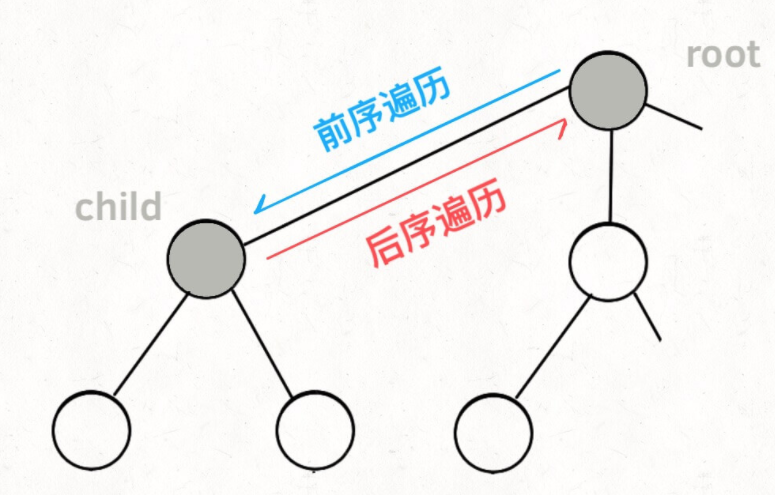

# 					回溯算法

## 回溯算法的术语

`路径` 已经做出的选择

`选择列表` 当前可以做的选择

`结束条件` 到达了决策树的底层，无法再做选择的条件

## 回溯算法代码框架

```c++
void backtrack(路径, 选择列表){
    if 满足结束条件:
        result.add(路径)
        return;
    
    for 选择 in 选择列表:
        做选择
        backtrack(路径, 选择列表)
        撤销选择
}
```

根据下述递归代码框架，`for`循环里面`做选择`属于前序遍历，而`撤销选择`属于后序遍历；之所以这样安排的原因可见下图所示

```c++
void traverse(TreeNode* root) {
    for (TreeNode* child : root->childern)
        // 前序遍历需要的操作
        traverse(child);
        // 后序遍历需要的操作
}
```



## 我的理解

1. 回溯算法本质上是`DFS`的一种应用

2. 利用回溯算法解题时，往往分为两个函数，一个是`backtrack()`函数，用于解决回溯本身,而且这个函数通常返回值是*void*；

   <!--也有特殊情况，backtrack带有返回值的，当只要找到一个结果就行了，需要在找到这个结果的时候就立刻返回，就需要返回值；如果需要找到所有的结果（所有的划分），那么这个时候的backtracking( )不需要返回值，这个时候添加一个参数ans（一个容器），用来装全部的结果。例如 Leetcode 698-->

   另一个是主函数，用以解决问题本身

3. 

## Leetcode相关题目

### [Leetcode 46](https://leetcode-cn.com/problems/permutations/) “全排列”

题目描述：给定一个不含重复数字的数组 `nums` ，返回其 **所有可能的全排列**。

```c++
class Solution {
public:
    vector<vector<int>> res;

    void backtrack(vector<int> nums, vector<int> track, vector<bool> used){
        // 结束条件
        if(track.size() == nums.size()){
            res.push_back(track);
            return;
        }

        for(int i = 0; i < nums.size(); i++){
            // 排除不合法的选择
            if(used[i] == true) continue;
            // 前序遍历，做选择
            track.push_back(nums[i]);
            used[i] = true;
            // 递归，进入下一层决策树
            backtrack(nums, track, used);
            // 后序遍历，取消选择
            track.pop_back();
            used[i] = false;
        }
    }

    vector<vector<int>> permute(vector<int>& nums) {
        vector<bool> used(nums.size(), false);
        vector<int> track;
        backtrack(nums, track, used);
        return res;
    }
};
```

### [Leetcode 51](https://leetcode-cn.com/problems/n-queens/) N皇后问题

题目描述：将 `n` 个皇后放置在 n×n 的棋盘上，并且使皇后彼此之间不能相互攻击。

给你一个整数 n ，返回所有不同的 n 皇后问题 的解决方案，方案中 'Q' 和 '.' 分别代表了皇后和空位。

`注` 不能相互攻击指的是皇后的行、列、对角线、斜对角线上没有皇后，如下图所示：


```c++
class Solution {
public:
    vector<vector<string>> res;

    void backtrack(vector<string>& board, int row){
        //结束条件
        if(row == board.size()){
            res.push_back(board); //放入皇后结束，将这一幅棋盘存入结果中
            return;
        }

        int n = board.size();
        for(int col = 0; col < n; col++){
            // 排除不合法的情况
            if(!isVaild(board, row, col)) continue;
            // 做选择
            board[row][col] = 'Q';
            // 进入下一层决策
            backtrack(board, row + 1);
            // 撤销选择
            board[row][col] = '.';
        }
    }
    /* 主函数， 返回n皇后问题的结果 */
    vector<vector<string>> solveNQueens(int n) {
        //初始化棋盘
        vector<string> board(n, string(n, '.')); //二维动态数组初始化
        backtrack(board, 0); // 从第0行开始
        return res;
    }

    /* 判断是否可以在 board[row][col] 放置皇后 */
    bool isVaild(vector<string> board, int row, int col){
        int n = board.size();
        /* 只需要检查当前行上方的元素 */
        // 1. 当前列
        for(int i = 0; i < row; i++){
            if(board[i][col] == 'Q') return false;
        }
        // 1. 左上方
        for(int i = row - 1, j = col - 1; i >= 0 && j >= 0; i--, j--){
            if(board[i][j] == 'Q') return false;
        }
        // 1. 右上方
        for(int i = row - 1, j = col + 1; i >= 0 && j < n; i--, j++){
            if(board[i][j] == 'Q') return false;
        }

        return true;
    }
};
```

### [Leetcode 698](https://leetcode-cn.com/problems/partition-to-k-equal-sum-subsets/) 划分k个相等的子集

题目描述：给定一个整数数组 `nums` 和一个正整数 `k`，找出是否有可能把这个数组分成 `k` 个非空子集，其总和都相等。

- 思路一：从每个数字的归属角度

```c++
class Solution {
public:
    /* 
        index : 当前数字的下标
        bucket[i] : 第i个桶内的数字之‘和’
    */
    bool backtrack(vector<int>& nums, int index, vector<int>& bucket, int target){
        // 1 结束条件
        if(index == nums.size()){
            for(int i = 0; i < bucket.size(); i++){
                if(bucket[i] != target) return false;
            }
            return true;
        }

        for(int i = 0; i < bucket.size(); i++){
            // 剪枝，排除一些不合法的情况
            if(bucket[i] + nums[index] > target) continue;
            // 前序遍历，做选择
            bucket[i] += nums[index];
            // 递归，进入下一层决策树，注意有返回值
            if(backtrack(nums, index + 1, bucket, target)) return true;
            // 后序遍历
            bucket[i] -= nums[index];
        }

        return false;
    }

    bool canPartitionKSubsets(vector<int>& nums, int k) {
        // 排除一些基本情况不符合的
        if(k > nums.size()) return false;
        int sum = 0;
        for(auto it : nums) sum += it;
        if(sum % k != 0) return false;

        struct cmp{
            bool operator()(int a, int b){
                return (a > b);
            }
        };
        // 将数组降序排列，使之能够能多的命中剪枝的情况，加快运算速度
        sort(nums.begin(), nums.end(), cmp());

        vector<int> bucket(k, 0);
        int target = sum / k;
        return backtrack(nums, 0, bucket, target);
    }
};
```

`注`

1. ```c++
   bool backtrack(vector<int>& nums, int index, vector<int>& bucket, int target){
   ```

   这个地方，传引用可以节省非常多的内存

   > C++函数参数记得传引用，不要传值，否则递归调用会大量复制 vector 

2. ```C++
   struct cmp{
       bool operator()(int a, int b){
           return (a > b);
       }
   };
   // 将数组降序排列，使之能够能多的命中剪枝的情况，加快运算速度
   sort(nums.begin(), nums.end(), cmp());
   ```

   这个地方如果不做降序排列的话，在Leetcode上无法通过

3. ```c++
   for(int i = 0; i < bucket.size(); i++){
   ```

   这个地方从每个数字角度看的话是要对桶进行遍历，看每个数字该放进那个桶里；相反，在思路二中从桶的角度的话，应该遍历数字，看每个桶该拥有哪个数字

- 思路二：从每个桶的角度

  ```C++
  class Solution {
  public:
      /*
      k : 第k个桶
      bucket : 当前桶中的数字之和
      start ： 从nums[start]元素开始
      used[i] : 某元素是否已经被装入桶里
      */
      bool backtrack(int k, int bucket, vector<int>& nums, int start, vector<bool>& used, int target){
          // 终止条件，k--到头了
          if(k == 0) return true;
          // 当前桶装满了，装下一个桶
          if(bucket == target) return backtrack(k - 1, 0, nums, 0, used, target);
  
          for(int i = start; i < nums.size(); i++){
              // 剪枝
              if(used[i]) continue;
              if(nums[i] + bucket > target) continue;
              // 前序遍历，做选择
              used[i] = true;
              bucket += nums[i];
              // 下一层递归
              if(backtrack(k, bucket, nums, i + 1, used, target)) return true;
              // 撤销选择
              used[i] = false;
              bucket -= nums[i];
          }
  
          return false;
      }
  
      bool canPartitionKSubsets(vector<int>& nums, int k) {
          // 排除一些基本情况
          if (k > nums.size()) return false;
          int sum = 0;
          for (auto it : nums) sum += it;
          if (sum % k != 0) return false;
          
          vector<bool> used(k, 0);
          int target = sum / k;
          // k 号桶初始什么都没装，从 nums[0] 开始做选择
          return backtrack(k, 0, nums, 0, used, target);
      }
  };
  ```

  
