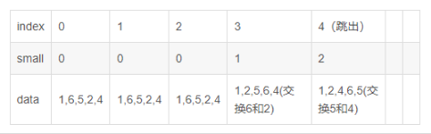

# 排序算法

## 排序算法分类

- 快速排序：剑指offer 2.4.2

  

## 快速排序

### 基本思路

先在数组中选择一个数字，接下来把数组中的数字分成两部分，比选择的数字小的数字移到数组的左边，比选择的数字大的数字移到数组的右边

### 代码实现

```C++
class Solution {
public:
    vector<int> sortArray(vector<int>& nums) {
        QuickSort(nums, nums.size(), 0, nums.size() - 1);
        return nums;      
    }

    void QuickSort(vector<int>& nums, int length, int start, int end){
        // base case
        if(start == end) return;

        int index = Partition(nums, length, start, end);
        if(index > start) QuickSort(nums, length, start, index - 1);
        if(index < end) QuickSort(nums, length, index + 1, end);
    }

    // 快速排序，「优美」
    // 返回值 切分的index
    int Partition(vector<int>& nums, int length, int start, int end){
        // 生成 [start, end] 之间的随机数，将这个索引对应的元素作为基准
        int index = rand() % (end - start + 1) + start; 

        // 交换基准元素和最后一个元素，也就是将基准元素放到最后去
        swap(nums[index], nums[end]);
        // small 用来记录 「下标小于 small 的元素均小于 基准元素」
        int small = start - 1;

        // for循环遍历整个数组  由于基准元素已经放在最后，所以index没有用了，这里作为遍历数组的下标
        // 特别注意这里是 「< end」 而不是 「< length」，即只会遍历到数组的倒数第二个元素（最后一个是基准，不用遍历）
        for(index = start; index < end; index++){
            // 如果当前遍历的元素小于基准元素
            if(nums[index] < nums[end]){
                //即 小于基准元素的元素+1个
                small++;
                // 把小的元素换到前面的对应的small个元素的位置去
                swap(nums[index], nums[small]);
            }
        }
        
        // <= small 的元素都比基准元素小了，那么我们将基准元素放到 small + 1 的位置
        small++;
        swap(nums[small], nums[end]);

        return small;
    }
};
```

`举例说明`

- 假如数据为 $data = [1, 6, 4, 2, 5]$​， $start = 0$, $end = 4$,   随机的 $index = 2$​​​，那么运行过程为

  

### 在题目中的应用

#### [剑指 Offer 40. 最小的k个数](https://leetcode-cn.com/problems/zui-xiao-de-kge-shu-lcof/) ★★

题目描述：输入整数数组 $arr$​ ，找出其中最小的 $k$​ 个数。例如，输入$4、5、1、6、2、7、3、8$​这8个数字，则最小的4个数字是$1、2、3、4$​​

`思路一` **快速选择——退化的快速排序**

```C++
class Solution {
public:
    vector<int> getLeastNumbers(vector<int>& arr, int k) {
        if(k == 0) return {};
        int start = 0;
        int end = arr.size() - 1;
        int index = Partition(arr, start, end);

        while(index + 1 != k){
            if(index + 1 > k){
                end = index - 1;
                index = Partition(arr, start, end);
            }
            else{
                start = index + 1;
                index = Partition(arr, start, end);
            }
        }

        vector<int> res;
        for(int i = 0; i <= index; i++){
            res.push_back(arr[i]);
        }
        
        return res;
    }
    
    int Partition(vector<int>& nums, int start, int end){
        // 基准数字选择数组中下标为 k 的元素，则使得比第 k 个数字小的所有数字都位于数组的左边
        int index = rand() % (end - start + 1) + start;
        
        // 表示数组中比基准元素小的个数 - 1 (表示的下标)
        int small = start - 1;

        // 将基准元素放到最后
        swap(nums[index], nums[end]);

        // 只需要遍历到数组的倒数第 2 个元素，因为最后一个是基准元素不用考虑
        for(index = start; index < end; index++){
            if(nums[index] < nums[end]){
                small++;
                swap(nums[index], nums[small]);
            }
        }

        small++;
        swap(nums[end], nums[small]);

        return small;
    }
};
```

`注`

1. 采用了 `Partition` 函数，和之前写的是一模一样的，其思路为，假设经过一次 $Partition$​​​ 操作，基准元素位于下标 $index$​​​，也就是说左侧的数组 + 基准元素本身 有 $index + 1$​​​ 个元素，是原数组中最小的 $index + 1$​​​​​​ 个数，那么：
   - 若 $k = index + 1$​​，我们就找到了最小的 $k$​​ 个数，就是左侧的数组                                 
   - 若 $k < index + 1$​ ，则最小的 $k$​ 个数一定都在左侧数组中，我们只需要对左侧数组 $Parition$​ 即可
   - 若 $k > index + 1$，则左侧数组中的 $index + 1$ 个数都属于最小的 $k$ 个数，我们还需要在右侧数组中寻找最小的 $k-（index + 1）$ 个数，对右侧数组 $Partition$​​ 即可
2.  `Partition` 函数的时间复杂度为 O(n)

`思路二` ：利用大顶堆

```C++
class Solution {
public:
    vector<int> getLeastNumbers(vector<int>& arr, int k) {
        if(arr.empty() || k == 0) return {};
        vector<int> res;
        // 构建一个大顶堆
        priority_queue<int> max_heap;

        for(int i = 0; i < k; i++){
            max_heap.push(arr[i]);
        }

        for(int i = k; i < arr.size(); i++){
            if(arr[i] < max_heap.top()){
                max_heap.pop();
                max_heap.push(arr[i]);
            }
        }

        for(int i = 0; i < k; i++){
            res.push_back(max_heap.top());
            max_heap.pop();
        }

        return res;
    }
};
```

`注`

- 先将 $arr$ 的前 $k$ 个数入堆，因为是最大堆，所以堆顶的数一定是最大的。
- 那么我们再从 $arr$ 的第 $k + 1$ 个元素迭代起，凡是遇到比当前堆顶元素小的，就将该元素 $push$ 入堆并 $pop$ 掉堆顶元素。
- 注意，每次执行完第二步之后，堆会自动更新，以保证堆顶元素始终为堆中所有元素的最大值。

> 两种方法的优劣性比较
> 在面试中，另一个常常问的问题就是这两种方法有何优劣。看起来分治法的快速选择算法的时间、空间复杂度都优于使用堆的方法，但是要注意到快速选择算法的几点局限性：

> 第一，算法需要修改原数组，如果原数组不能修改的话，还需要拷贝一份数组，空间复杂度就上去了。

>  第二，算法需要保存所有的数据。如果把数据看成输入流的话，使用堆的方法是来一个处理一个，不需要保存数据，只需要保存 k 个元素的最大堆。而快速选择的方法需要先保存下来所有的数据，再运行算法。当数据量非常大的时候，甚至内存都放不下的时候，就麻烦了。所以当数据量大的时候还是用基于堆的方法比较好。

