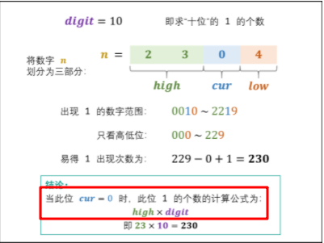
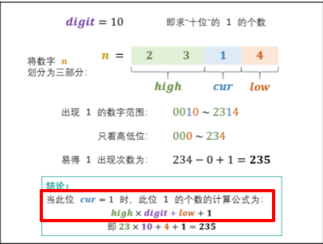
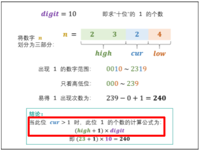
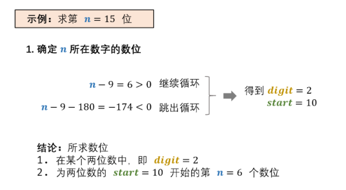
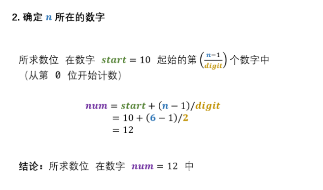
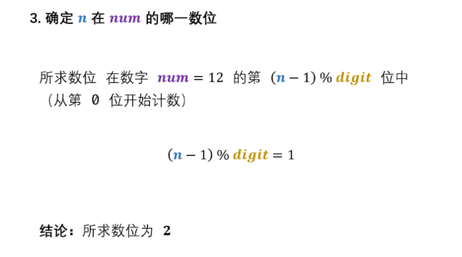
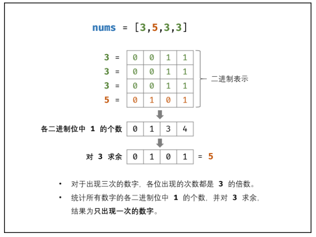

# 数学相关

#### [剑指 Offer 43. 1～n 整数中 1 出现的次数](https://leetcode-cn.com/problems/1nzheng-shu-zhong-1chu-xian-de-ci-shu-lcof/)

题目描述：输入一个整数 n ，求1～n这n个整数的十进制表示中1出现的次数

```C++
class Solution {
public:
    int countDigitOne(int n) {
        // digit 表示当前考虑 位置 的 「位因子」 10^i (i表示第i位)
        long digit = 1;
        int res = 0;
        // 当前考虑位置的高位
        int high = n / 10;
        // 当前考虑位
        int cur = n % 10;
        // 当前考虑位置的低位
        int low = 0;

        while(high != 0 || cur != 0){
            if(cur == 0) res += high * digit;
            else if(cur == 1) res += high * digit + low + 1;
            else res += high * digit + digit;

            low += cur * digit;
            cur = high % 10;
            high /= 10;
            digit *= 10;
        }

        return res;
    }
};
```

`注`

1. 总体思路如下：

   ```swift
   1 2 [0] 1 ： [0]位置可能出现 1 的频数
   想象 ： 一个密码锁 将 [0] 换成 [1] ，然后拨动其他位置，使得拨动后的数字不得超过 1 2 [0] 1 这样就可以统计出 [0] 处 1 出现的个数 ，以此类推 将 每位 1 出现次数 相加得到 结果
   ```

2. 具体来说，需要根据当前考虑的位置 $cur$ 分为 3 种情况

   

   

   

#### [剑指 Offer 44. 数字序列中某一位的数字](https://leetcode-cn.com/problems/shu-zi-xu-lie-zhong-mou-yi-wei-de-shu-zi-lcof/)

题目描述：数字以$0123456789101112131415…$​​的格式序列化到一个字符序列中。在这个序列中，第$5$位（从下标$0$开始计数）是$5$，第$13$位是$1$，第$19$位是$4$​，等等。请写一个函数，求任意第$n$位对应的数字

```C++
class Solution {
public:
    int findNthDigit(int n) {
        // 数字 1010 是一个两位数，称此数字的 位数 为 22 ，记为 digit
        int digit =  1;
        // 每 digit 位数的起始数字（即：1, 10, 100, ⋯），记为 start
        long long start = 1;
        // 将 101112⋯ 中的每一位称为 数位 ，记为 count
        long long count = 9;

        // 步骤 1 对应下图-1
        while(n > count){
            n -= count;
            digit += 1;
            start *= 10;
            count = digit * start * 9;
        }
        // 步骤 2 对应下图-2
        long num = start + (n - 1) / digit;

        //步骤 3 对应下图-3
        string s = to_string(num);
        return s[(n - 1) % digit] - '0';
    }
};
```

`注`

1. 思路示例

   

   

   

### 位运算相关

#### [剑指 Offer 56 - I. 数组中数字出现的次数](https://leetcode-cn.com/problems/shu-zu-zhong-shu-zi-chu-xian-de-ci-shu-lcof/)

题目描述：一个整型数组 $nums$​ 里除两个数字之外，其他数字都出现了两次。请写程序找出这两个只出现一次的数字。要求时间复杂度是 $O(n)$，空间复杂度是 $O(1)$.

`注意` 要注意题目中要求空间复杂度要是 $O(1)$，因此不能使用哈希表来做

```C++
class Solution {
public:
    vector<int> singleNumbers(vector<int>& nums) {
        // 所有数字 异或 起来的结果
        int k = 0;
        for(auto num : nums){
            k ^= num;
        }

        
        // 设置mask为1，则二进制为0001
        // mask是一个二进制数，且其中只有一位是1，其他位全是0，比如000010，
        // 表示我们用倒数第二位作为分组标准，倒数第二位是0的数字分到一组，倒数第二位是1的分到另一组
        int mask = 1;

        // 用上面的e.g. 4和6的二进制是不同的 我们从右到左找到第一个不同的位就可以分组 4=0100 6=0110
        // 根据e.g. 010 & 001 = 000 = 0则 mask=010
        // 010 & 010 != 0 所以mask=010
        // 获取 k 中最低位置的 1
        while((k & mask) == 0){
            mask = mask << 1;
        }

        int a = 0;
        int b = 0;

        for(auto num : nums){
            if((num & mask) == 0) a ^= num;
            else b ^= num;
        }

        return {a, b};
    }
};
```

`注`

1. 总体思路为：当数组中只出现一个“落单”的数字时，可以采用 「异或」 的方式，这样就可以直接找出落单的数字

   所以这道题可以采用 先将数组分组，将成单的数字分到不同的组，然后再分别异或得到两个落单的数字

2. 然后，通过mask中的1一位一位的向左移动，找到 k 中的最低位置的 1，k中的每个 1 都代表着 最后这两个不同数字的不同的位置，因此按照这写个 1 来分类一定可以将这两个数字分到不同的组，为了方便起见，就选择最低位置的 1.

#### [剑指 Offer 56 - II. 数组中数字出现的次数 II](https://leetcode-cn.com/problems/shu-zu-zhong-shu-zi-chu-xian-de-ci-shu-ii-lcof/)

题目描述：在一个数组 nums 中除一个数字只出现一次之外，其他数字都出现了三次。请找出那个只出现一次的数字

```C++
class Solution {
public:
    int singleNumber(vector<int>& nums) {
        // res 为只出现的一次的数字
        int res = 0;

        // 由于题目说每个数字都是32 位 的int类型，所以对每一位做累加，对3取模，若不为 0，
        // 说明 那个只出现一次的数字在这个位置上有值
        for(int i = 0; i < 32; i++){
            // 当前 考虑的位的和
            int sum = 0;
            // 数组中的每个数字累加上来
            for(int& num : nums){
                // num & 0x1 可以可获取二进制数字 num 的最右一位 是否为 1
                // 配合右移操作，统计每一位是否为 1 
                sum += (num >> i) & 0x1;
            }
            // 将 1 放在当前对应的考虑位上
            if(sum % 3 == 1) res = res | (1 << i);
        }
        return res;
    }
};
```

`注`

1. 思路为：如下图所示，考虑数字的二进制形式，对于出现三次的数字，各 二进制位 出现的次数都是 3 的倍数。
   因此，统计所有数字的各二进制位中 1 的出现次数，并对 3 求余，结果则为只出现一次的数字

   
